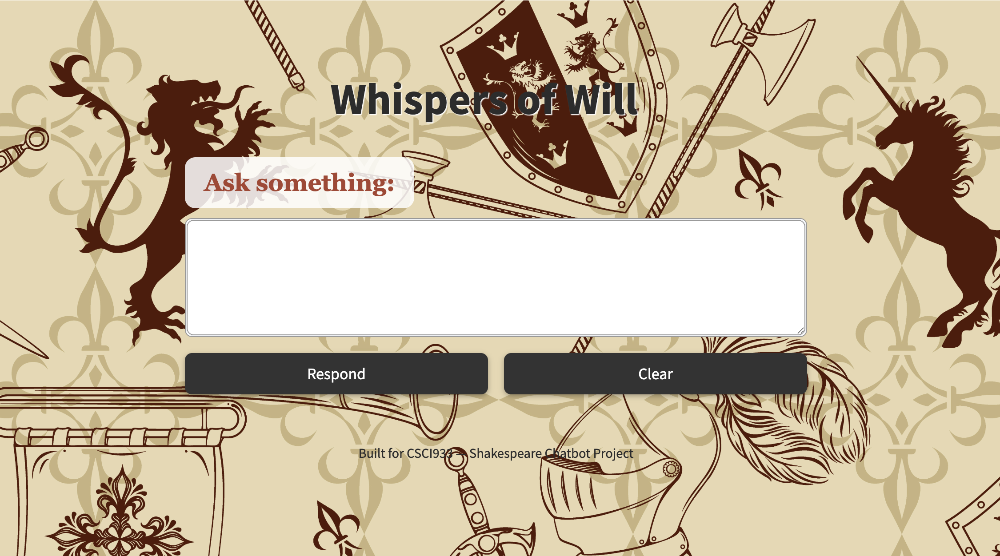

# Whispers of Will: A Shakespeare AI Assistant

A locally-run chatbot that interprets Shakespeare’s plays, quotes, and characters — fully offline using open-source models.

> **Built for CSIT933 – Assignment 2 (2025)**

---

## Overview

**Whispers of Will** is an AI-powered assistant that helps users explore the works of William Shakespeare. The assistant supports natural-language interaction to:

- Explain famous quotes with context and interpretation
- Summarise scenes from Shakespeare’s plays
- Answer general questions about characters, themes, or events
- Maintain basic memory over recent turns

All of this is done **completely offline**, using:

- `Mistral-7B-Instruct-Q4_K_M` for generation
- `MiniLM-L6-v2` for semantic retrieval
- FAISS for fast scene and quote matching

---

## Key Features (with Screenshots)

### 1. General Web Interface

The chatbot runs on a clean and medieval-inspired Streamlit frontend:



---

### 2. Quote Retrieval + Explanation

Ask the assistant for the meaning of a famous quote, and it will locate the scene, provide context, and explain its meaning:

> **Query**: _What does "Out, out, brief candle" mean?_  
> **Result**:


---

### 3. Multi-turn Memory

The assistant remembers recent exchanges, and adjusts context-aware answers accordingly.

Example:

> **User**: What does the candle quote mean?  
> **User** (later): Why is this quote so famous?

The assistant maintains context across both:


### 4. Scene Summarisation

Summarises entire scenes in modern English using retrieval + Mistral summarisation:

> **Query**: _Summarise the balcony scene in Romeo and Juliet._


---

### 5. General QA + Thematic Reasoning

Ask why characters did something, or explore themes:

> **Query**: _Why did Brutus betray Caesar?_


---

---

## FAISS Index Construction

To support fast quote and scene retrieval, the system uses a FAISS semantic index:

1. **Text Preprocessing**:

   - Raw Shakespeare .txt files (from Folger corpus) are parsed by a script to extract quote entries, including metadata such as play, scene, speaker, and context.

2. **Embedding**:

   - Quotes and scene blocks are embedded using `MiniLM-L6-v2` into 384-d vectors.

3. **Index Building**:

   - FAISS `IndexFlatL2` is used to store these vectors.
   - Embeddings are saved as `scene_level_quote.faiss`.
   - Metadata is saved as `scene_level_quote.pkl`.

4. **During Inference**:
   - User queries are embedded and searched against the FAISS index.
   - Top-k semantic matches are retrieved for response generation.

---

## Project Structure

```
├── app.py                      # Streamlit frontend
├── core/
│   ├── responder.py            # Mistral-7B via llama-cpp
│   ├── search_quote.py         # Quote-level semantic retrieval
│   ├── match_scene.py          # Scene search + summarisation
├── data/
│   ├── scene_level_quote.pkl   # Metadata
│   ├── scene_level_quote.faiss # FAISS vector index
│   └── text/                   # Raw Shakespeare .txt files
├── models/
│   └── mistral-7b-instruct...  # Quantized GGUF
├── utils/
│   └── styles.py               # UI styling
```

---

## Setup Instructions

1. **Install dependencies**:

```bash
pip install -r requirements.txt
```

2. **Download Mistral GGUF model**:

- `Mistral-7B-Instruct-Q4_K_M`
- Place into `models/` folder

3. **Run the app**:

```bash
streamlit run app.py
```

---

## Assignment Criteria Support

| Requirement                                     | Supported |
| ----------------------------------------------- | --------- |
| Scene summarisation (modern English)            | ✅        |
| Quote explanation with context                  | ✅        |
| General factual and thematic Q&A                | ✅        |
| Multi-turn reasoning with conversational memory | ✅        |

---

## Models Used

- **Generator**: `mistral-7b-instruct.Q4_K_M.gguf`
- **Retriever**: `sentence-transformers/all-MiniLM-L6-v2`
- **Data Source**: Folger Shakespeare Library Corpus
