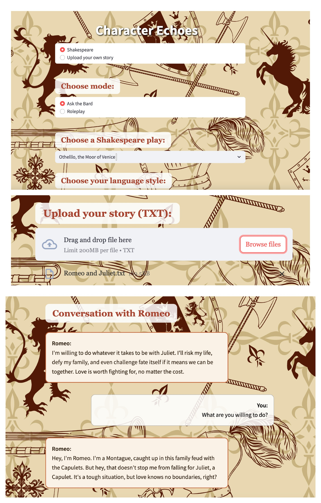

# Character Echoes

**Character Echoes** is an AI-powered roleplay companion that enables users to interact with **historical** and **fictional characters** through immersive conversation. This project is built as an MVP to demonstrate the potential for **educational tools**, **interactive storytelling**, and **creative exploration** using AI-driven dialogue. 

---

## Purpose

While many AI chatbots today rely on **predefined prompt** and **manual fine-tuning** for known characters, they often lack flexibility when it comes to **less popular figures** or **custom narratives**. Most of the products are purely prompt based and can not output accurate results when it comes to historical figures through quote searching or validation. This project seeks to address this gap by creating a flexible roleplay environment where users can:

- Upload their own literary works, notes, or slides
- Create or simulate _any_ character based on real or fictional content
- Engage in conversations for **language learning**, **storytelling**, or **historical education**
- Gain accurate results since the model will use the file as its knowledge base.

Because I am a solo participant with limited time, I focused this project on Shakespeare and a custom character option — inspired by a dear friend who loves literature and Shakespeare. The final goal is to eventually extend this platform beyond Shakespeare to **mythologies**, **historical figures**, **novels**, or **user-generated worlds** — offering new possibilities for:

- Teachers could upload slides and have students interact with a simulated historical figure.
- Writers could upload drafts and simulate conversations between characters.
- Learners could engage with language, context, and creativity in real-time dialogue.

---

## Features

- **Roleplay with Shakespearean Characters**  
  Talk to Hamlet, Lady Macbeth, Juliet, Romeo, and more, each with their own unique speaking style and knowledge drawn from Shakespeare’s works.

- **Custom Character Roleplay**  
  Enter any character from Shakespeare’s plays, and the AI will simulate their personality.

- **Upload Your Own Story**  
  Upload a `.txt` file of your own writing (or other historical fiction), and create characters based on it! The AI's responses will be based solely on the uploaded content.

- **Modern English or Bard Style**  
  Choose whether you want conversations in poetic Shakespearean English or simple modern English.

- **Quote Search Engine**  
  When you ask questions, the AI also retrieves relevant quotes or passages from the selected play or book to enrich the conversation.

---

## Example Use Cases

- "Summarize Act 3 Scene 1 of Macbeth in modern English."
- "Hamlet, what do you think about fate?"
- "Juliet, would you still love Romeo in today's world?"
- "Talk to a custom character from my own novel."

---

## Project Structure

```
├── app.py                 # Main Streamlit frontend
├── core/
│   ├── loader.py           # Load text files, search quotes, and manage uploads
│   └── responder.py        # OpenAI API handling
├── utils/
│   └── styles.py           # Custom CSS injection
├── data/
│   ├── source/             # Shakespearean plays and user-uploaded works
│   └── character_prompts/  # Character instruction files (.md)
├── requirements.txt
└── README.md
```

---

## Setup (Local)

1. Set your OpenAI API Key (either via environment variable or Streamlit Secrets):

```bash
export OPENAI_API_KEY=your-api-key
```

2. Run the app locally:

```bash
streamlit run app.py
```

3. If you want to add more novels or file you can add it onto the data foler.

---

## Deployment

- Can be deployed easily on **Streamlit Cloud** or **Hugging Face Spaces** or any choice, just need to modify some of the code.
- Remember to safely configure your API Key via secret management tools if deploy or put it into environemental variables if run locally.
- Demo Link: https://legends-ai-roleplay.streamlit.app
- ## Here's an example screenshot: 


---

## Attribution

- Shakespeare texts from [Project Gutenberg](https://www.gutenberg.org/)
- Built using [Streamlit](https://streamlit.io)
- Powered by [OpenAI API](https://platform.openai.com)
- Background image by macrovectorok on Freepik

---

## Author

**Xixian Huang**  
for the [Microsoft AI Agent Hackathon](https://github.com/microsoft/AI_Agents_Hackathon)

---
